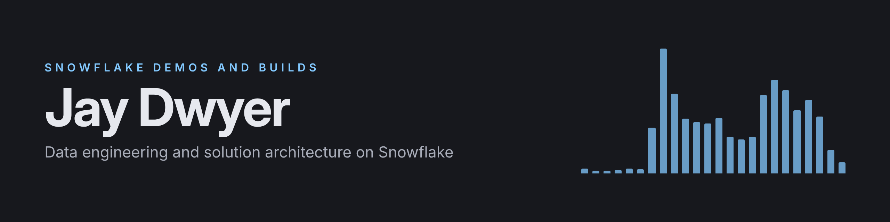

I'm a hands-on data engineer and solution architect working on Snowflake, based in Brisbane. I like taking a real problem from the first business conversation through to a design and a working build.

My recent builds explore one theme: **right-sized data governance** for teams that rely on subject matter experts rather than a dedicated governance function. Each one is a stage of the same arc.

| Stage | Project | What it does | Built with |
|---|---|---|---|
| **Capture** | [Requirements Accelerator](https://github.com/jaydwyerdata/requirements-accelerator) ([demo video](https://youtu.be/bQh05tJXABo)) | A self-serve interview that turns a vague data request into a plain-language business ask and a technical spec, and says honestly whether it's ready to build | Python, Streamlit in Snowflake, Cortex AI |
| **Use** | meaning-to-semantic-view *(in progress)* | Captures what business terms actually mean, in the experts' own words, and turns it into a validated Snowflake semantic view | Semantic views, Cortex Analyst, Snowpark |
| **Share** | *(next)* | Governed external sharing with row access policies | Secure sharing, row access policies |

And one for range:

| Project | What it does | Built with |
|---|---|---|
| [Listening Lens](https://github.com/jaydwyerdata/listening-lens) ([demo video](https://youtu.be/dOxFxmPNGrs)) | Eight years of my Spotify history as a Snowflake Native App, including the consumer bind path through references | Native Apps Framework, Streamlit in Snowflake, Cortex AI |

And reusable patterns, packaged as agent skills:

| Skill | What it does | Built with |
|---|---|---|
| [Snapshot CDC delta pattern](https://github.com/jaydwyerdata/snowflake-skills/tree/main/snowflake-cdc-delta-pattern) | Turns a curated view into an append-only, action-tagged delta table for reverse ETL, with field-level change history, deletes and retention built in. Worked example verified live | Snowflake Scripting, tasks, Cortex Code skills |
| [Row access mapping pattern](https://github.com/jaydwyerdata/snowflake-skills/tree/main/snowflake-row-access-mapping) | Row-level security for one shared table: mapping table plus row access policy, CSV onboarding and offboarding with validation and an audit trail, and a governed copy that survives the source table being rebuilt. Both worked examples verified live | Row access policies, Snowflake Scripting, tasks, Cortex Code skills |

## How I build

- **Problem first.** Every project starts from a real problem and documents the decisions behind it, not just the code.
- **Claims I can defend.** READMEs state what was actually verified, and where. Unverified numbers stay flagged.
- **Built with AI, disclosed openly.** I use Claude as a drafting and review partner; the problem framing, design calls and scope decisions are mine, and each repo says how it was built.
